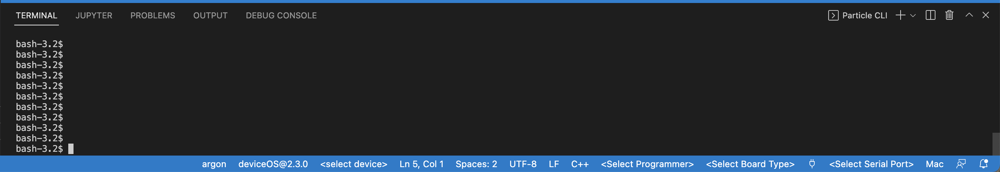

# Lecture 1
Our goal for the first class is to become acquainted with the Particle Argon, our microcontroller development board for the semester. Particle boards have several special aspects which led to their selection for this class:
- They are IoT (Internet of Things) capable, meaning they can be used to stream data to the cloud in (near-)real time. The Argon has Wi-Fi and Bluetooth Low Energy capabilities. Wi-Fi data can be streamed to the Particle Cloud and therefore to all sorts of other endpoints, like Google Sheets. More on this later in the semester.
- They follow the [Adafruit Feather Specification](https://learn.adafruit.com/adafruit-feather/feather-specification). This means that we can use all sorts of ready-made add-ons when we need additional functions (e.g., GPS for geolocation, SD card for datalogging)
- Programming Particle boards uses a fork of Wiring (Arduino's language), so it's easier to teach due to the abundance of Arduino resources.
- All software for Particle is free (for example, VS Code and the Particle Workbench extensions)

## Getting Started
### Download Particle Workbench
Downloading Particle Workbench (https://www.particle.io/workbench/) will give you Microsoft's free VS Code editor and several extensions for working with Particle devices. It allows us to write code on our computers and then compile and flash it. "Compile" means to take the firmware code from the lines written on our computers and turn it into a file that provides instructions for the microcontroller in the microcontroller's language. "Flash" means to upload that compiled code onto the microcontroller so that it will follow the instructions.

### Set up Argon
This requires access to a Wi-Fi network for the Argon and failed miserably in our first class because the Argon couldn't connect to our main WPA2 Wi-Fi network which requires username and password nor to our guest network (for unknown reasons, likely strict university security protocols). Skip setup for now. 

Moving on...

### Blink an LED
Generally, the simplest exercise to complete with a new microcontroller board like the Particle Argon is to blink an LED to show that you can successfully compile and flash code. The Argon has multiple LEDs and Particle provides example code and instructions: https://docs.particle.io/getting-started/hardware-tutorials/hardware-examples/. 

However, due to the issues with Wi-Fi setup described above, this can be much harder than it seems it should be! The workaround is to turn off the Wi-Fi radio on the Argon. This can be accomplished with a call to `SYSTEM_MODE(SEMI_AUTOMATIC)` at the top of the script (before `void setup()`). More info on this issue and solution here: https://community.particle.io/t/use-argon-without-wi-fi-and-without-setup/63040. 

So, again, skip setting up the Argon and instead use the code from the Blink_LED.ino script in this folder. 

### Create a Project
- Create a new project by opening the Particle command palette and selecting Particle: Create New Project. Put this project in a sensible spot on your computer, ideally one that is backed up to the cloud (UNCW offers free OneDrive storage, an excellent way to make sure you never lose important stuff, especially related to assignments!). I recommend creating a class folder titled something like OCN479-Smart-Coasts or whatever you want. 
- Once you have the directory in which you want to store your Particle projects for this class, create a project name for this project. Something like Blink_LED.
- Paste the code from the file named Blink_LED.ino into the .ino file that is generated for this new project.
- See next step for how to compile and flash code and get it working with the Argon.

### Troubleshooting and Additional Steps
Code for the Argon has to be compiled using the same Device OS that is on the Argon. According to the Particle Forum link above, the devices ship with 1.4.4, which is rather out of date. Here's how to get stuff synced up properly:
1. From Workbench, open the Particle command palette (Ctrl+Shift+P on Windows, Cmd+Shift+P on Mac).
2. Type "particle"
3. Select "Particle Launch CLI"
4. Put the Argon into DFU (device firmware update) mode by pressing and holding the Mode button on the Argon while pressing and releasing the Reset button. Continue holding Mode until the RGB (Red Green Blue) LED starts flashing yellow.
5. Run the following line of code in the CLI (command line interface) that pops up: `particle update`. This should update your Device OS, in my case to 2.3.0. 
6. Check your Device OS by putting the Argon in listening mode (press and hold Mode until the LED blinks blue) and typing the following command into the CLI: `particle identify`
7. Configure Workbench to work with the Device OS that you confirmed you're using in the previous step. Your settings should look something like this on the bottom of Workbench: 

