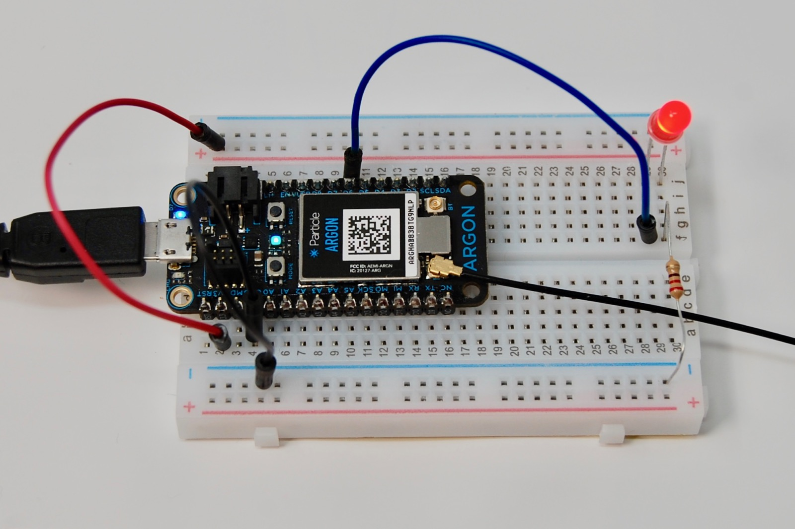

# Lab 4
## Blink external LED
Following our early examples of blinking an onboard LED (i.e., the one mounted on your Particle Argon at the factory) and adding in what we've learned about breadboards, today's lab focuses on building a simple LED circuit on a breadboard. 

Note that today's lab borrows from Particle documentation--specifically, https://docs.particle.io/getting-started/hardware-tutorials/hardware-examples/#blink-an-external-led. 

## Breadboard setup
**CRITICAL SAFETY MESSAGE**: *for your and the electronics' safety, do not change circuitry while the board is powered! Instead, always disconnect your power supply (either battery or USB cable) before changing anything on the breadboard. Don't touch positive and ground wires/pins to each other directly or via breadboard connections (i.e., "short circuit").*

Note that the breadboard has red (+) and blue (-) "rails" along its outer edges on the left and right. These typically indicate positive power supply and ground. However, it is critical to note that any given column (rail) or row on a breadboard serves no specific function whatsoever until a wire or metal pin is connected to it. There's nothing magical about the blue (-) rail that makes it automatically serve as ground; it must be connected to the board's (or other device's) ground to function as such. Nonetheless, it is common practice to consider red to be positive and blue to be negative/ground, and sticking with this convention will prevent confusion when circuits become more complex.

Note also that while there is only one ground on the Argon (marked GND or using the ground symbol), there could be several positive voltage/power supplies. For example, 3V3 on the Argon supplies 3.3 V from a voltage regulator (meaning it should be a reasonably stable 3.3 V). VBATT is connected to an external battery's positive lead, and the Argon uses 3.7 V nominal lithium polymer batteries which can be charged up to ≈ 4.1 V and can discharge to much lower than 3.7 V. We're not yet using external batteries, so connecting to VBATT would supply 0 V! FInally, we also have VUSB which takes the positive voltage supply from the USB cable which, if connected to a computer, is ≈ 5 V. Different components require different min/max voltage supplies, so pay close attention to which one you "pipe" into the positive power rail on the breadboard.

Place the Argon onto the breadboard in such a way that when the word "Argon" is rightside up you have the pins on the left of the Argon in breadboard holes on the left of the little valley in the breadboard and you have the pins on the right of the Argon in breadboard holes on the right of the valley. It doesn't strictly matter how far left/right as long as all the pins have breadboard holes/clips to go into. However, we'll make connections to breadboard clips just to the left and right of the left and right pins (respectively) of the Argon, so leave ≥ 1 column to the left and ≥ 1 column to the right. Ensure the top and bottom pins of the Argon aren't extending beyond the top or bottom of the breadboard (i.e., all Argon pins should now have breadboard holes/clips). Press firmly, but not with too much force that the pins bend, on top of the Argon. 

### Additional connections
(Copied from Particle docs.) Position the LED in the breadboard. The long lead (anode) goes to + (left) and the short lead (cathode) goes to - (right). When using an LED, you must always add a current liming resistor. Normally you'd use a 220 ohm resistor (red-red-brown-gold) for 3.3 volt circuits.

In the picture, the long lead of the LED connects to pin D6 using the blue wire. The short lead of the LED connects to a 220 ohm resistor that connects it to ground. That completes the circuit.

For this exercise, we can take a couple shortcuts. (1) The antenna is not necessary (this is the cable going off the right side of the image above). (2) We won't use prototyping wires (the red, black, and blue wires in the photo). We will make more direct connections, such as by skipping the black wire which takes the Argon's ground and creates a ground rail on the breadboard and instead going from the Argon's ground to one lead of the resistor, and picking up the circuit from there. 

### How to use a Multimeter
*Live demo*. Every group should check voltage, resistance, and connectivity of parts on their breadboard.

## Lab Exercise
Teams of 3:  
1. Using the description above, the photo, and https://docs.particle.io/getting-started/hardware-tutorials/hardware-examples/#blink-an-external-led, build the external LED circuit. 
2. Draw a circuit diagram corresponding to your circuit using [circuit-diagram.org](https://www.circuit-diagram.org/). To complete this exercise, you will have to look up examples of "led circuit diagrams" online. You will have to show the following for full credit:
  1. The Argon's GPIO pin and ground pin (the Boron serves as our power supply, but swap out the power supply/battery symbol that shows up in most LED circuit diagram examples for a rectangle representing the Argon and its many pins. Refer to the Argon pinout (on Particle docs or last week's lab notes) for more detail.
  2. The LED's cathode and anode
  3. Both sides of the resistor
2. Before plugging in the USB cable, confirm with Bresnahan that your circuit looks correct.
3. Blink the LED using our old Blink_LED project but changing from the pin that we used in that script (to blink the onboard LED) to the pin corresponding to the GPIO pin you chose for this circuit. Make sure you change all references to the pin in the script. 
4. Create a GitHub repository, or use your old Blink_LED one (creating a new one might be easier due to the way git tracks changes). Push to it your entire Particle project as well as your circuit diagram. Add a README.md file to the main repository/folder that describes what we can find in the repo (e.g., code and a circuit diagram) and provides instructions on how to build the circuit. For instructions, you may copy and paste from these notes as long as you reference this repository (note that the [repository's license](../LICENSE.txt) is very permissive).  
5. Submit a link to your full GitHub repo in Canvas.

Only one person per team needs to create this repository, but all are equally responsible for its contents!